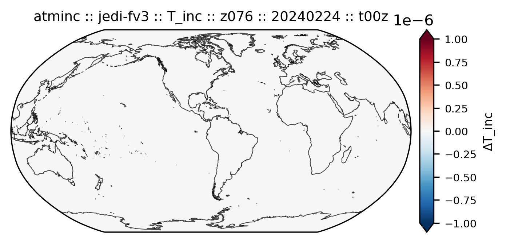
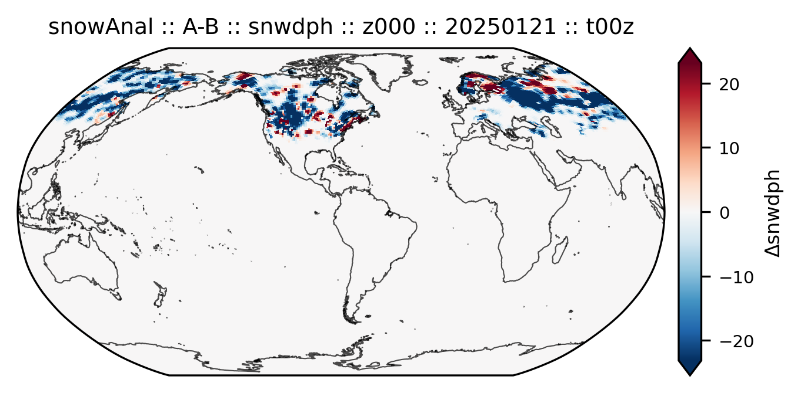
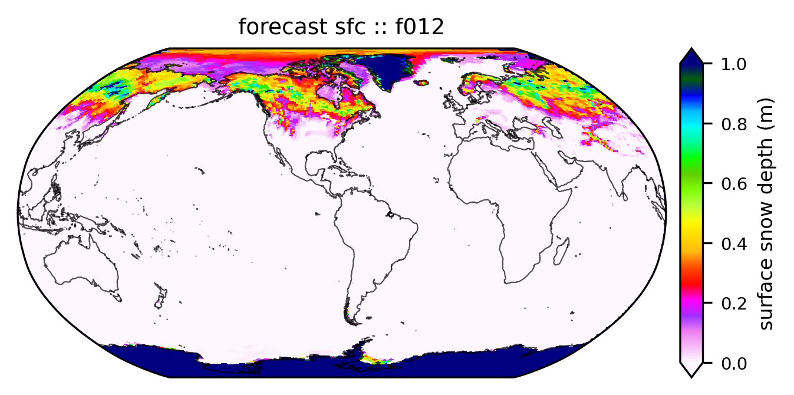
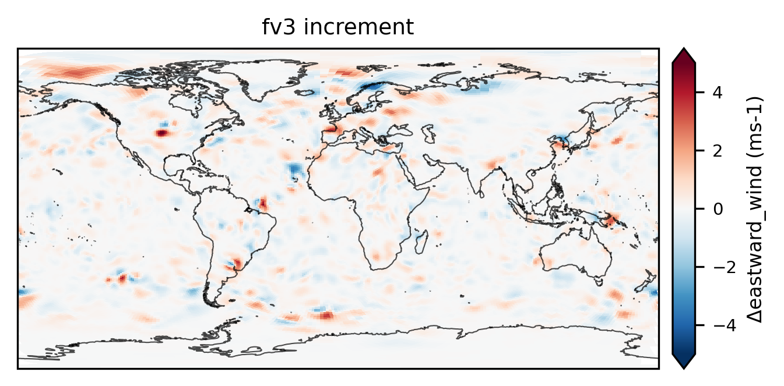
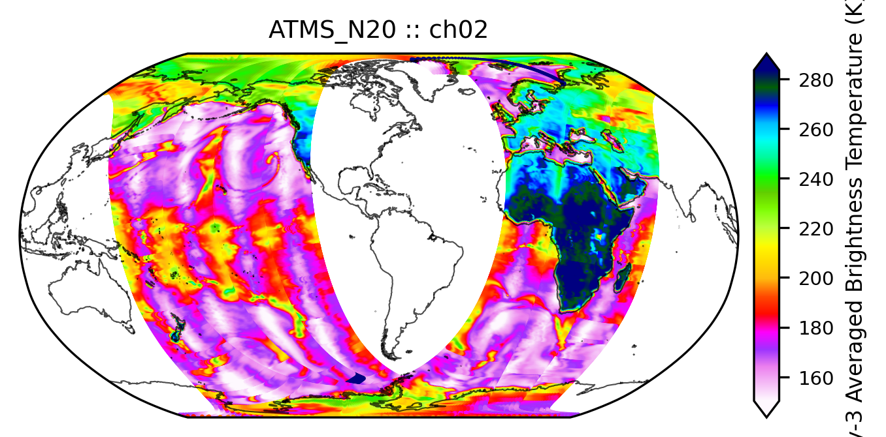
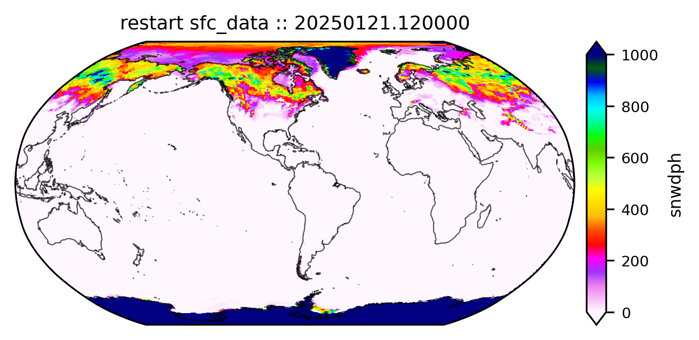
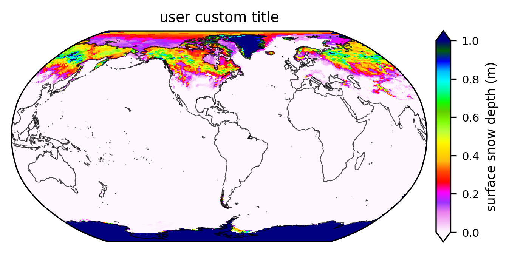

Configuration
*************

Difference plot between FV3 and JEDI increment files
====================================================

.. code-block:: yaml

   input:
     parameters:
       cycle: t00z
       PDY: 20240224
   
     datasets:
       - name: fv3
         data_kind: increment   # increment | analysis | forecast | restart | observation | etc.
         geo:
           path: /work2/noaa/epic/chjeon/ufsda_hercules/ufs-da-workflow/fix/DATA_fix/FV3/Tiled/C96
           filename: C96.mx100_oro_data
           file_type: orog      # file | orog | tile
         data:
           path: /work2/noaa/epic/chjeon/ufsda_hercules/ufs-da-workflow/fix/DATA_ref/atm
           filename: ufsda.t00z.atminc.cubed_sphere_grid
           file_type: tile      # file | tile
           var_list:
             - T_inc
             - u_inc
             - v_inc
           z_index: 76
           time_index: 0
         colormap:
           default: gist_ncar_r
           T_inc: RdBu_r
           u_inc: RdBu_r
           v_inc: RdBu_r
         range:
           default:
             vmin: null
             vmax: null
           T_inc:
             vmin: -2.5
             vmax: 2.5
           u_inc:
             vmin: -5
             vmax: 5
           v_inc:
             vmin: -5
             vmax: 5
         title: "fv3 increment"
   
       - name: jedi
         data_kind: increment   # increment | analysis | forecast | restart | observation | etc.
         geo:
           path: /work2/noaa/epic/chjeon/ufsda_hercules/ufs-da-workflow/fix/DATA_ref/atm
           filename: cubed_sphere_grid_atminc.jedi.nc
           file_type: file      # file | orog | tile
         data:
           path: /work2/noaa/epic/chjeon/ufsda_hercules/ufs-da-workflow/fix/DATA_ref/atm
           filename: cubed_sphere_grid_atminc.jedi.nc
           file_type: file      # file | tile
           var_list:
             - tmp
             - ugrd
             - vgrd
           z_index: 76
           time_index: 0
         colormap:
           default: gist_ncar_r
           tmp: RdBu_r
           ugrd: RdBu_r
           vgrd: RdBu_r
         range:
           default:
             vmin: null
             vmax: null
           tmp:
             vmin: -2.5
             vmax: 2.5
           ugrd:
             vmin: -5
             vmax: 5
           vgrd:
             vmin: -5
             vmax: 5
         title: "jedi increment"
   
     differences:
       - name: jedi-fv3
         base: fv3
         target: jedi
         var_pairs:
           - base: T_inc
             target: tmp
           - base: u_inc
             target: ugrd
           - base: v_inc
             target: vgrd
         colormap:
           default: RdBu_r
           T_inc: RdBu_r
           u_inc: RdBu_r
           v_inc: RdBu_r
         range:
           default:
             vmin: null
             vmax: null
           T_inc:
             vmin: null
             vmax: null
           u_inc:
             vmin: null
             vmax: null
           v_inc:
             vmin: null
             vmax: null
         title: "increment diff: fv3-jedi"
   
   output:
     path: ./
     prefix: atminc
   
   plot:
     cartopy_ne_path: /work2/noaa/epic/chjeon/ufsda_hercules/ufs-da-workflow/fix/NaturalEarth
     projection:
       name: Robinson    # Robinson | PlateCarree | Mollweide 
       central_longitude: -77.0369  # D.C.
     figure:
       figsize: [5, 2.5]
       dpi: 300
     colorbar:
       extend: both   # neither | both | min | max
       size: "3.5%"
       pad: 0.08
       label_fontsize: 8
       tick_fontsize: 7
     title:
       fontsize: 9
     background:
       features:
         - coastline
         #- land
         #- lakes
         #- states
         #- borders
       resolution: 50m
       linewidth: 0.5
       alpha: 0.7

Difference plot between before and after JEDI analysis for snow-DA
==================================================================

.. code-block:: yaml

   input:
     parameters:
       cycle: t00z
       PDY: 20250121
   
     datasets:
       - name: before
         data_kind: analysis   # increment | analysis | forecast | restart | observation | etc.
         geo:
           path: /work2/noaa/epic/UFS-DA-Workflow_v1.0/inputs/DATA_fix/FV3/Tiled/C96
           filename: C96.mx100_oro_data
           file_type: orog      # file | orog | tile
         data:
           path: /work2/noaa/epic/UFS-DA-Workflow_v1.0/inputs/DATA_ref/land
           filename: 20250121.000000.sfc_data.before
           file_type: tile      # file | tile
           var_list:
             - snwdph
             - smc
           z_index: 0
           time_index: 0
         colormap:
           default: gist_ncar_r
           snwdph: null
           smc: null
         range:
           default:
             vmin: null
             vmax: null
           snwdph:
             vmin: null
             vmax: null
           smc:
             vmin: null
             vmax: null
         title: "snow-DA: before analysis"
   
       - name: after
         data_kind: analysis   # increment | analysis | forecast | restart | observation | etc.
         geo:
           path: /work2/noaa/epic/UFS-DA-Workflow_v1.0/inputs/DATA_fix/FV3/Tiled/C96
           filename: C96.mx100_oro_data
           file_type: orog      # file | orog | tile
         data:
           path: /work2/noaa/epic/UFS-DA-Workflow_v1.0/inputs/DATA_ref/land
           filename: 20250121.000000.sfc_data.after
           file_type: tile      # file | tile
           var_list:
             - snwdph
             - smc
           z_index: 0
           time_index: 0
         colormap:
           default: gist_ncar_r
           snwdph: null
           smc: null
         range:
           default:
             vmin: null
             vmax: null
           snwdph:
             vmin: null
             vmax: null
           smc:
             vmin: null
             vmax: null
         title: "snow-DA: after analysis"
   
     differences:
       - name: A-B
         base: before
         target: after
         var_pairs:
           - base: snwdph
             target: snwdph
           - base: smc
             target: smc
         colormap:
           default: RdBu_r
           snwdph: RdBu_r
           smc: RdBu_r
         range:
           default:
             vmin: null
             vmax: null
           snwdph:
             vmin: null
             vmax: null
           smc:
             vmin: null
             vmax: null
         title: "snow-DA: after-before"
   
   output:
     path: ./
     prefix: snowAnal
   
   plot:
     cartopy_ne_path: /work2/noaa/epic/UFS-DA-Workflow_v1.0/inputs/NaturalEarth
     projection:
       name: Robinson    # Robinson | PlateCarree | Mollweide 
       central_longitude: -77.0369  # D.C.
     figure:
       figsize: [5, 2.5]
       dpi: 300
     colorbar:
       extend: both   # neither | both | min | max
       size: "3.5%"
       pad: 0.08
       label_fontsize: 8
       tick_fontsize: 7
     title:
       fontsize: 9
     background:
       features:
         - coastline
         #- land
         #- lakes
         #- states
         #- borders
       resolution: 50m
       linewidth: 0.5
       alpha: 0.7

Forecast result plot (surface data files)
=========================================

.. code-block:: yaml

   input:
     parameters:
       cycle: t00z
       PDY: 20250121
   
     datasets:
       - name: sfc
         data_kind: forecast   # increment | analysis | forecast | restart | observation etc.
         geo:
           path: /work2/noaa/epic/UFS-DA-Workflow_v1.0/inputs/DATA_ref/forecast
           filename: ufsda.t00z.sfc.f*.c96.tile1.nc
           file_type: tile      # file | orog | tile
         data:
           path: /work2/noaa/epic/UFS-DA-Workflow_v1.0/inputs/DATA_ref/forecast
           filename: ufsda.t00z.sfc.f*.c96.tile1.nc
           file_type: tile      # file | tile
           var_list:
             - snod
           z_index: 0
           time_index: 0
         colormap:
           default: gist_ncar_r
           snod: null
         range:
           default:
             vmin: null
             vmax: null
           snod:
             vmin: null
             vmax: null
         title: "forecast sfc"
   
   output:
     path: ./
     prefix: fcst
   
   plot:
     cartopy_ne_path: /work2/noaa/epic/UFS-DA-Workflow_v1.0/inputs/NaturalEarth
     projection:
       name: Robinson    # Robinson | PlateCarree | Mollweide 
       central_longitude: -77.0369  # D.C.
     figure:
       figsize: [5, 2.5]
       dpi: 300
     colorbar:
       extend: both   # neither | both | min | max
       size: "3.5%"
       pad: 0.08
       label_fontsize: 8
       tick_fontsize: 7
     title:
       fontsize: 9
     background:
       features:
         - coastline
         #- land
         #- lakes
         #- states
         #- borders
       resolution: 50m
       linewidth: 0.5
       alpha: 0.7

Increment file plot of JEDI and FV3
===================================

.. code-block:: yaml

   input:
     parameters:
       cycle: t00z
       PDY: 20240224
   
     datasets:
       - name: fv3
         data_kind: increment   # increment | analysis | forecast | restart | observation | etc.
         geo:
           path: /work2/noaa/epic/chjeon/ufsda_hercules/ufs-da-workflow/fix/DATA_fix/FV3/Tiled/C96
           filename: C96.mx100_oro_data
           file_type: orog      # file | orog | tile
         data:
           path: /work2/noaa/epic/chjeon/ufsda_hercules/ufs-da-workflow/fix/DATA_ref/atm
           filename: ufsda.t00z.atminc.cubed_sphere_grid
           file_type: tile      # file | tile
           var_list:
             - T_inc
             - u_inc
             - v_inc
           z_index: 76
           time_index: 0   # optional (default = 0)
         colormap:
           default: gist_ncar_r
           T_inc: RdBu_r
           u_inc: RdBu_r
           v_inc: RdBu_r
         range:
           default:
             vmin: null
             vmax: null
           T_inc:
             vmin: -2.5
             vmax: 2.5
           u_inc:
             vmin: -5
             vmax: 5
           v_inc:
             vmin: -5
             vmax: 5
         title: "fv3 increment"
   
       - name: jedi
         data_kind: increment   # increment | analysis | forecast | restart | observation | etc.
         geo:
           path: /work2/noaa/epic/chjeon/ufsda_hercules/ufs-da-workflow/fix/DATA_ref/atm
           filename: cubed_sphere_grid_atminc.jedi.nc
           file_type: file      # file | orog | tile
         data:
           path: /work2/noaa/epic/chjeon/ufsda_hercules/ufs-da-workflow/fix/DATA_ref/atm
           filename: cubed_sphere_grid_atminc.jedi.nc
           file_type: file      # file | tile
           var_list:
             - tmp
             - ugrd
             - vgrd
           z_index: 76
           time_index: 0   # optional (default = 0)
         colormap:
           default: gist_ncar_r
           tmp: RdBu_r
           ugrd: RdBu_r
           vgrd: RdBu_r
         range:
           default:
             vmin: null
             vmax: null
           tmp:
             vmin: -2.5
             vmax: 2.5
           ugrd:
             vmin: -5
             vmax: 5
           vgrd:
             vmin: -5
             vmax: 5
         title: "jedi increment"
   
   output:
     path: ./
     prefix: atmdata
   
   plot:
     cartopy_ne_path: /work2/noaa/epic/chjeon/ufsda_hercules/ufs-da-workflow/fix/NaturalEarth
     projection:
       name: Robinson    # Robinson | PlateCarree | Mollweide 
       central_longitude: -77.0369  # D.C.
     figure:
       figsize: [5, 2.5]
       dpi: 300
     colorbar:
       extend: both   # neither | both | min | max
       size: "3.5%"
       pad: 0.08
       label_fontsize: 8
       tick_fontsize: 7
     title:
       fontsize: 9
     background:
       features:
         - coastline
         #- land
         #- lakes
         #- states
         #- borders
       resolution: 50m
       linewidth: 0.5
       alpha: 0.7

Observation file plot (IODA format)
===================================

.. code-block:: yaml

   input:
     parameters:
       cycle: t00z
       PDY: 20240224
   
     datasets:
       - name: atms
         data_kind: observation   # increment | analysis | forecast | restart | observation | etc.
         data:
           path: /work2/noaa/epic/UFS-DA-Workflow_v1.0/inputs/DATA_obs/fv3/20240224 
           filename: obs.20240224.t00z.atms_n20.nc
           group: ObsValue
           var_list:
             - brightnessTemperature
           channels: [2, 7, 15, 22]
         colormap:
           default: gist_ncar_r
           brightnessTemperature: null
         range:
           default:
             vmin: null
             vmax: null
           brightnessTemperature:
             vmin: null
             vmax: null
         title: "ATMS_N20"
   
       - name: ghcn
         data_kind: observation   # increment | analysis | forecast | restart | observation | etc.
         data:
           path: /work2/noaa/epic/UFS-DA-Workflow_v1.0/inputs/DATA_obs/ghcn
           filename: obs.20250121.t00z.ghcn_snow.nc
           group: ObsValue
           var_list:
             - totalSnowDepth
           channels: null
         colormap:
           default: gist_ncar_r
           totalSnowDepth: null
         range:
           default:
             vmin: null
             vmax: null
           totalSnowDepth:
             vmin: null
             vmax: null
         title: "GHCN snow"
   
   output:
     path: ./
     prefix: obs
   
   plot:
     cartopy_ne_path: /work2/noaa/epic/UFS-DA-Workflow_v1.0/inputs/NaturalEarth
     projection:
       name: Robinson    # Robinson | PlateCarree | Mollweide 
       central_longitude: -77.0369  # D.C.
     figure:
       figsize: [5, 2.5]
       dpi: 300
     colorbar:
       extend: both   # neither | both | min | max
       size: "3.5%"
       pad: 0.08
       label_fontsize: 8
       tick_fontsize: 7
     title:
       fontsize: 9
     scatter:
       marker_size: 0.5
     background:
       features:
         - coastline
         #- land
         #- lakes
         #- states
         #- borders
       resolution: 50m
       linewidth: 0.5
       alpha: 0.7

Restart file plot (UFS weather model)
=====================================

.. code-block:: yaml

   input:
     parameters:
       cycle: t00z
       PDY: 20250121
   
     datasets:
       - name: sfc_data
         data_kind: restart   # increment | analysis | forecast | restart | observation etc.
         geo:
           path: /work2/noaa/epic/UFS-DA-Workflow_v1.0/inputs/DATA_fix/FV3/Tiled/C96
           filename: C96.mx100_oro_data
           file_type: orog      # file | orog | tile
         data:
           path: /work2/noaa/epic/UFS-DA-Workflow_v1.0/inputs/DATA_ref/restart
           filename: '*.sfc_data.tile1.nc'
           file_type: tile      # file | tile
           var_list:
             - snwdph
           z_index: 0
           time_index: 0
         colormap:
           default: gist_ncar_r
           snwdph: null
         range:
           default:
             vmin: null
             vmax: null
           snwdph:
             vmin: null
             vmax: null
         title: "restart sfc_data"
   
   output:
     path: ./
     prefix: rst
   
   plot:
     cartopy_ne_path: /work2/noaa/epic/UFS-DA-Workflow_v1.0/inputs/NaturalEarth
     projection:
       name: Robinson    # Robinson | PlateCarree | Mollweide 
       central_longitude: -77.0369  # D.C.
     figure:
       figsize: [5, 2.5]
       dpi: 300
     colorbar:
       extend: both   # neither | both | min | max
       size: "3.5%"
       pad: 0.08
       label_fontsize: 8
       tick_fontsize: 7
     title:
       fontsize: 9
     background:
       features:
         - coastline
         #- land
         #- lakes
         #- states
         #- borders
       resolution: 50m
       linewidth: 0.5
       alpha: 0.7

Surface data file plot
======================

.. code-block:: yaml

   input:
     parameters:
       cycle: t00z
       PDY: 20240224
   
     datasets:
       - name: sfc
         data_kind: single   # increment | analysis | forecast | restart | observation | etc.
         geo:
           path: /work2/noaa/epic/UFS-DA-Workflow_v1.0/inputs/DATA_ref/forecast
           filename: ufsda.t00z.sfc.f000.c96
           file_type: tile   # file | orog | tile
         data:
           path: /work2/noaa/epic/UFS-DA-Workflow_v1.0/inputs/DATA_ref/forecast
           filename: ufsda.t00z.sfc.f000.c96
           file_type: tile   # file | tile
           var_list:
             - snod
             - soilm
           z_index: 0
           time_index: 0   # optional (default = 0)
         colormap:
           default: gist_ncar_r
           snod: null
           soilm: null
         range:
           default:
             vmin: null
             vmax: null
           snod:
             vmin: null
             vmax: null
           soilm:
             vmin: null
             vmax: null
         title: "user custom title"
   
   output:
     path: ./
     prefix: sfcdata
   
   plot:
     cartopy_ne_path: /work2/noaa/epic/chjeon/ufsda_hercules/ufs-da-workflow/fix/NaturalEarth
     projection:
       name: Robinson    # Robinson | PlateCarree | Mollweide 
       central_longitude: -77.0369  # D.C.
     figure:
       figsize: [5, 2.5]
       dpi: 300
     colorbar:
       extend: both   # neither | both | min | max
       size: "3.5%"
       pad: 0.08
       label_fontsize: 8
       tick_fontsize: 7
     title:
       fontsize: 9
     background:
       features:
         - coastline
         #- land
         #- lakes
         #- states
         #- borders
       resolution: 50m
       linewidth: 0.5
       alpha: 0.7

